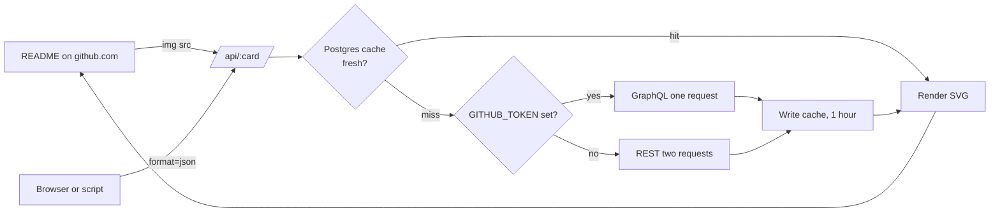

# GitHubStats - developer documentation

A serverless GitHub stats card API. Thirteen endpoints, each rendering one SVG card, deployed as
a single Next.js app on Vercel with Supabase Postgres behind it as a cache.

## Table of contents

- [Tech stack](#tech-stack)
- [Architecture overview](#architecture-overview)
- [How a request is served](#how-a-request-is-served)
- [The two GitHub paths](#the-two-github-paths)
- [Username validation, and why it is a security boundary](#username-validation-and-why-it-is-a-security-boundary)
- [Rendering a card](#rendering-a-card)
- [Themes and colour overrides](#themes-and-colour-overrides)
- [The grade](#the-grade)
- [Data model](#data-model)
- [Degrading without a database](#degrading-without-a-database)
- [Privacy: the view log](#privacy-the-view-log)
- [Project structure](#project-structure)
- [Environment variables](#environment-variables)
- [Local development](#local-development)
- [Testing](#testing)
- [Continuous integration](#continuous-integration)
- [Deployment](#deployment)
- [Security notes](#security-notes)
- [Known constraints](#known-constraints)
- [Documentation](#documentation)

## Tech stack

| Layer | Choice | Why |
|---|---|---|
| Framework | Next.js 16, App Router | Route handlers are the whole API; one deployment target |
| Language | TypeScript, strict | `any` is a lint error, enforced in CI |
| Rendering | Template literals producing SVG | No rendering library; the output is text and belongs in the repository as text |
| Database | Postgres (Supabase) via `pg` | A cache and a counter, nothing relational |
| Styling (landing page) | Tailwind v4 | The page is a card builder, not the product |
| Hosting | Vercel | `vercel.json` caps each function at 15s and sets CORS for `/api/*` |

## Architecture overview



There is no server beyond the route handlers, and no state beyond the cache. Two deployments of
this repository share nothing except the database they are pointed at.

## How a request is served

1. The route reads `username` and `format` from the query string.
2. `fetchGitHubData` validates the username, then looks in the cache (Postgres, falling back to
   an in-process map).
3. On a miss it calls GitHub, normalises the response into `GitHubUserRawData`, and caches it for
   an hour.
4. The route either returns JSON or hands the data to a renderer, which returns an SVG string.
5. Anything thrown becomes an **error card**, not a 500 with an empty body. A broken image in a
   profile README tells the reader nothing.

## The two GitHub paths

`GITHUB_TOKEN` set: GraphQL, one request, and the only way to get the contribution calendar.
No token: REST, two requests, 60 per hour, no calendar.

The paths are not equivalent, and the fallback matters more than it looks: **a GraphQL failure
falls through to REST**, so both have to be equally safe with untrusted input. That is how an
input flaw in the REST path stayed reachable on a deployment that had a token.

```ts
if (token) {
  try { userData = await fetchViaGraphQL(cleanUsername); }
  catch { userData = await fetchViaRest(cleanUsername); }   // <- the safe path leads here
} else {
  userData = await fetchViaRest(cleanUsername);
}
```

## Username validation, and why it is a security boundary

`isValidGitHubUsername` enforces GitHub's own rule: 1 to 39 characters, letters, digits and single
hyphens, never leading, trailing or doubled.

It is not tidiness. `fetchViaRest` interpolates the name into an API path, and a URL resolves `..`
before the request is sent:

```
username = "../orgs/github"
  -> https://api.github.com/users/../orgs/github
  -> https://api.github.com/orgs/github
```

Those requests carry `Authorization: Bearer ${GITHUB_TOKEN}`. Unvalidated, any caller of a public
card endpoint could aim this deployment's own token at any GitHub API path and read the answer.

The check runs in `fetchGitHubData`, **before the cache lookup as well as the fetch**, so an
unchecked name cannot become a cache key either. `encodeURIComponent` on the REST paths is a
second line, not the first.

## Rendering a card

Every renderer is a pure function from `GitHubUserRawData` plus options to a string. No DOM, no
library, no async.

Two rules hold everywhere:

1. **Every value that came from GitHub goes through `escapeXml`.** The response is served as
   `image/svg+xml`, so an unescaped `<` is script execution for whoever opens the card URL, not a
   rendering bug.
2. **Icons are SVG paths, never emoji.** An emoji in an SVG renders with whatever emoji font the
   viewer has; on a Linux browser without one it is an empty box, in a card whose entire purpose
   is to be embedded in other people's READMEs.

`scripts/check-cards.ts` enforces both. See [Testing](#testing).

### A note on animations

Cards use CSS animations for a fade-in. Animate **opacity only**. A CSS `transform` on a group
that is positioned by a `transform` attribute replaces that attribute, and the element animates
itself to the SVG origin: the stats card's trophy spent a commit rendering in the top-left corner
for exactly this reason.

## Themes and colour overrides

Twelve named themes in `lib/themes.ts`. Any card also accepts individual colours
(`bg_color`, `title_color`, `text_color`, `icon_color`, `border_color`), which beat the theme.

Every override passes `sanitizeHex` first. These values land inside SVG attributes, so an
unchecked one closes the attribute and writes markup.

Theme-derived colours must cover **both ends**. A hardcoded dark constant looks fine until
somebody picks `light`: the 3D calendar's empty cubes were `#161b22`, which on a white card was a
year of solid black squares, including the "Less" legend swatch.

## The grade

A weighted score, then a band:

```
score = stars*10 + commits*1.5 + prs*15 + issues*5 + followers*5 + contributedTo*20
```

| Score | Grade | Percentile shown |
|---|---|---|
| >= 5000 | S+ | 99.5 |
| >= 2500 | S | 98 |
| >= 1200 | A+ | 92 |
| >= 600 | A | 85 |
| >= 300 | B+ | 70 |
| >= 100 | B | 50 |

The percentile is a **label on the band, not a measurement** of the GitHub population. It is
presented as "TOP x%" on the card, which is the most generous reading of a number nobody
calibrated. Treat it as decoration.

## Data model

Three tables, all in `db/schema.sql`, all safe to re-run.

| Table | Holds |
|---|---|
| `github_stats_cache` | `cache_key`, `data` jsonb, `expires_at`. One hour per username |
| `github_profile_views` | `username`, `views`, `last_viewed_at`. One row per counted user |
| `github_view_logs` | One row per counter request: `ip_hash`, `user_agent`, `referrer` |

Nothing is relational and nothing is joined. Postgres is a shared cache with a counter attached.

**The schema lived only on the server until 2026-10-01.** Three tables created by hand, recorded
nowhere, so a second deployment had no way to stand itself up and no record of the columns.

## Degrading without a database

Every database call is wrapped, and every failure falls back to an in-process `Map`:

- the cache becomes per-instance and dies with the process;
- the view counter becomes per-instance and resets.

This is deliberate. A profile README is a public page, and a database outage should not turn it
into a broken image. `/api/health` reports `unhealthy: <reason>` rather than failing, so the
degradation is visible rather than silent.

The consequence to keep in mind: **on Vercel, "per-instance" means per lambda**, so without
`DATABASE_URL` the view count is meaningless rather than merely approximate.

## Privacy: the view log

`github_view_logs.ip_hash` is a salted SHA-256 prefix, and is **NULL unless `IP_HASH_SALT` is
set**. There is no unsalted fallback on purpose: an IPv4 space is four billion values and a
laptop reverses an unsalted hash of it in minutes, so hashing without a salt would be the
appearance of anonymisation rather than the thing.

Until 2026-10-01 this column held the **raw address** from `x-forwarded-for`, under a name that
said otherwise. If this deployment ran before that date, the old rows are still raw:

```sql
-- what is actually in there
SELECT count(*) FROM github_view_logs WHERE ip_hash LIKE '%.%' OR ip_hash LIKE '%:%';
-- and, if you want them gone
UPDATE github_view_logs SET ip_hash = NULL WHERE ip_hash LIKE '%.%' OR ip_hash LIKE '%:%';
```

## Project structure

```
app/
  api/<card>/route.ts   One route per card. Reads the query, calls the renderer
  page.tsx              The card builder, which is also the documentation
lib/
  github.ts             GraphQL and REST paths, normalisation, username validation
  db.ts                 Cache, counter, and the memory fallback for both
  themes.ts             12 palettes plus per-request hex overrides
  utils.ts              escapeXml, errorMessage, hashVisitorIp, grade, icons
  renderers/            13 pure functions, each returning one SVG string
db/schema.sql           The three tables
scripts/check-cards.ts  Renders every card and parses it
```

## Environment variables

| Variable | Required | Without it |
|---|---|---|
| `DATABASE_URL` | no | Cache and counter fall back to memory, per instance |
| `GITHUB_TOKEN` or `GH_TOKEN` | no | REST path only: 60 requests an hour, no contribution calendar |
| `IP_HASH_SALT` | no | No visitor IP is stored at all |

Nothing here is required to run the app, which is the point: `npm run dev` works on a clean clone.

## Local development

```bash
npm install
npm run dev                 # localhost:3000, or the next free port
DATABASE_URL= npm run dev   # force the memory fallback, write nothing to a real database
```

The second form is what to use when working against a `.env.local` that points at production.
An inline variable beats `.env.local`, so no file needs editing and nothing can be left behind.

## Testing

```bash
npm run check-cards
```

Renders all thirteen cards twice: once with ordinary data, once with
`"><script>alert(1)</script>` in every text field. It fails if the SVG does not parse, if a
`<script>` element appears, or if the element count changes between the two passes - escaping may
do what it likes as long as it adds no elements.

It is a real gate, not a smoke test: deleting one `escapeXml` from the summary card fails it with
`a <script> element reached the output`.

There is no unit test suite beyond this. For a codebase that is thirteen pure string functions
and two fetch paths, parsing the actual output catches more than asserting on substrings would.

## Continuous integration

`.github/workflows/ci.yml`, on push to `main`, on pull requests, and manually.

| Job | Does |
|---|---|
| `build` | `npm run lint`, `tsc --noEmit`, `npm run build` |
| `cards` | `npm run check-cards` |
| `audit` | `npm audit --audit-level=high`, full, not `--omit=dev` |
| `readme` | Regenerates `README-light.md` and fails on a diff |

No schedule. A cron on a repository that changes rarely spends minutes to say nothing changed.

The repository had **no CI at all** until 2026-10-01, which is why it was carrying 28 lint errors
and a critical advisory (GHSA-vcvr-r3jv-pc5j, RCE in `next/og`) at the same time.

## Deployment

Vercel, from `main`. `vercel.json` sets a 15 second cap per function and permissive CORS on
`/api/*`, which a card has to have: it is loaded cross-origin by definition.

Set `DATABASE_URL`, `GITHUB_TOKEN` and `IP_HASH_SALT` in the project's environment, then apply
`db/schema.sql` once to the database.

## Security notes

- **Username validation is the boundary.** See the section above; it is the one input that
  reaches a URL.
- **Every GitHub-sourced string is escaped** on its way into SVG, and `check-cards` proves it.
- **Colour overrides are hex-validated** before reaching an attribute.
- **CORS is `*` on purpose.** These are public cards with no credentials and no cookies; the
  endpoint reads public GitHub data and writes nothing a caller controls.
- **The counter is the only write**, and it is a per-username integer. `increment=false` reads
  without counting, which is what this project's own landing page uses.
- No authentication anywhere, because there is nothing to authenticate.

## Known constraints

- **The REST path cannot produce a contribution calendar.** Without a token, `/api/calendar-3d`
  and the streak figures are approximations from the repository list.
- **Language percentages are bytes**, which is what GitHub reports. Verbose languages are
  flattered; this is GitHub's measure, not a correction of it.
- **WakaTime requires the user to have a public WakaTime profile.** Absent, the card says so.
- **The grade percentile is not calibrated.** See [The grade](#the-grade).
- **`AGENTS.md` is regenerated by `next dev`** and carries em dashes against the house style.
  Sweeping it would be undone by the next developer command, so it is left.

## Documentation

- [README.md](./README.md) and its generated twin [README-light.md](./README-light.md)
- [db/schema.sql](./db/schema.sql)
- [not_for_you.md](./not_for_you.md) - the small decisions and everything considered and rejected
