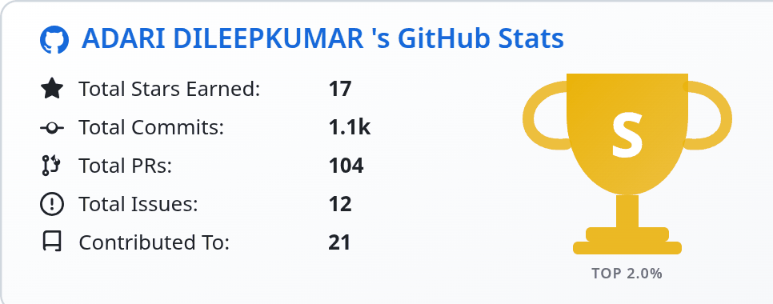
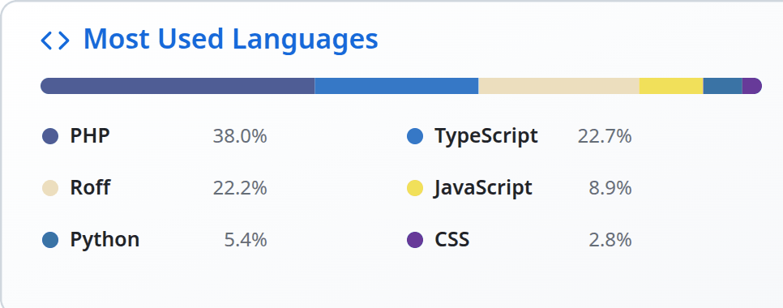
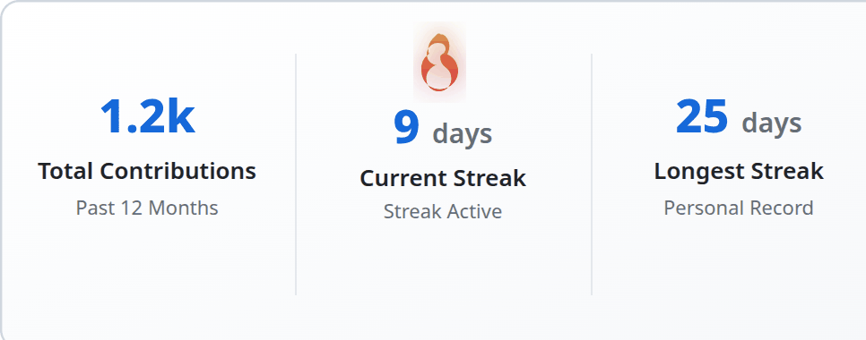
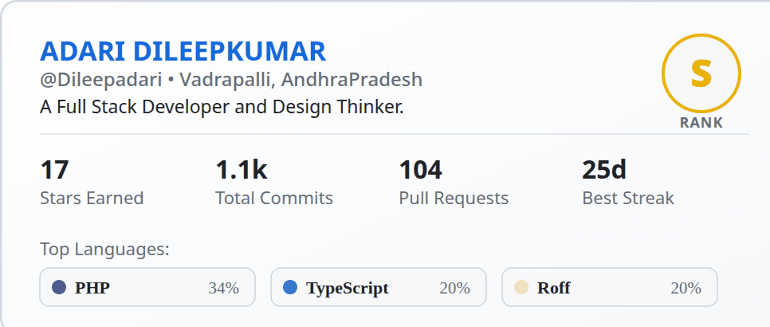
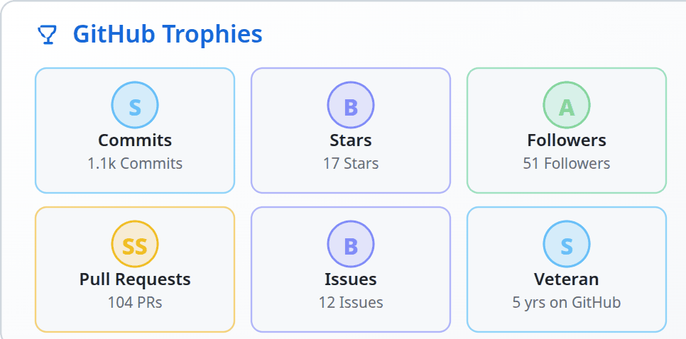
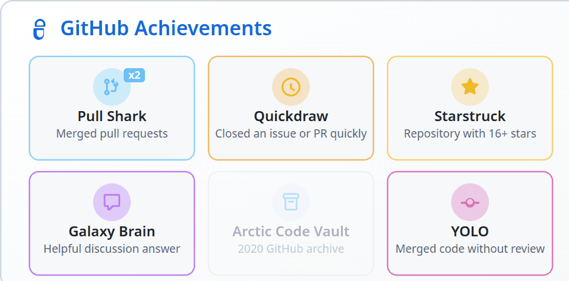
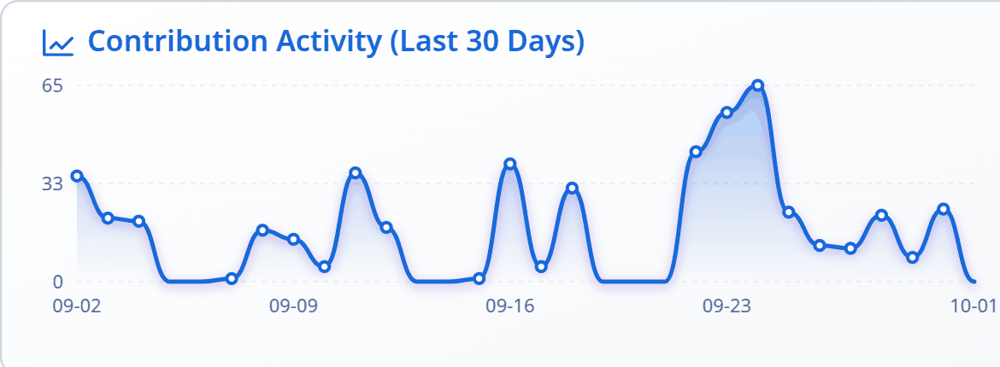
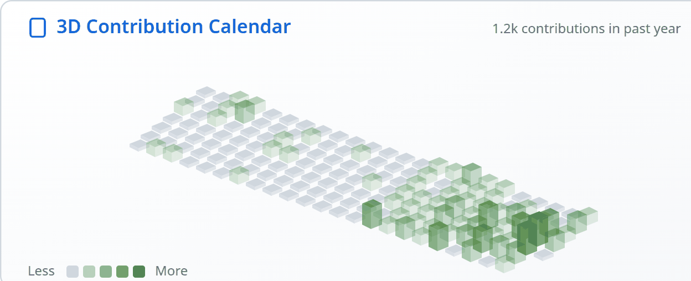
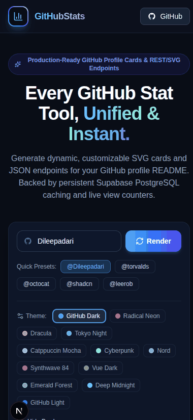
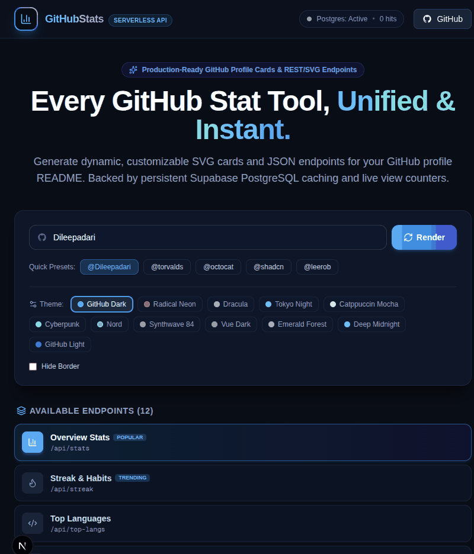

<!-- Generated from README.md by scripts/build-light-readme.mjs. Do not edit by hand. -->

<div align="center">

<picture>
  <source media="(prefers-color-scheme: dark)" srcset="./docs/assets/adk_dev_logo_light.png">
  
</picture>

# GitHubStats

**Thirteen endpoints that turn a GitHub username into an SVG card for a profile README, or into JSON for anything else. One deployment, no per-card service, and every card still renders when the database is gone.**


<br>


[](https://github.com/Dileepadari/GitHubStats/actions/workflows/ci.yml)

<br>

**[Developer documentation](./DEVDOC.md)** &middot; [Cards](#the-cards) &middot; [Endpoints](#endpoints) &middot; [Customising](#customising-a-card) &middot; [Run it](#run-it)

<p><b>Light mode</b> &middot; <a href="./README.md">View this page in dark mode</a></p>

</div>

---

Every card is a URL. Put it in a profile README and GitHub renders it:

```markdown

```

Add `&format=json` to the same URL and you get the data instead, which is the point of building it
once rather than thirteen times.

## The cards

Rendered at 2x from a live deployment, in the `default` theme. The same gallery in the `light`
theme is in **[README-light.md](./README-light.md)**.

<table>
<tr>
  <td width="33%" valign="top">
    
    <p align="center"><b>Overview</b><br><sub>The headline totals, with the grade on a trophy.</sub></p>
  </td>
  <td width="33%" valign="top">
    
    <p align="center"><b>Top languages</b><br><sub>By bytes written, which is what GitHub reports.</sub></p>
  </td>
  <td width="33%" valign="top">
    
    <p align="center"><b>Streaks</b><br><sub>Total, current and longest, given equal weight.</sub></p>
  </td>
</tr>
<tr>
  <td width="33%" valign="top">
    
    <p align="center"><b>Summary</b><br><sub>Everything on one card, for a README that wants one.</sub></p>
  </td>
  <td width="33%" valign="top">
    
    <p align="center"><b>Trophies</b><br><sub>One per threshold crossed, graded.</sub></p>
  </td>
  <td width="33%" valign="top">
    
    <p align="center"><b>Achievements</b><br><sub>Recomputed from public data. Unearned ones stay dim.</sub></p>
  </td>
</tr>
</table>

<table>
<tr>
  <td width="50%" valign="top">
    
    <p align="center"><b>Activity graph</b><br><sub>Thirty days, scaled to the busiest one.</sub></p>
  </td>
  <td width="50%" valign="top">
    
    <p align="center"><b>3D calendar</b><br><sub>A year of contributions, height by count.</sub></p>
  </td>
</tr>
</table>

<details>
<summary><b>The card builder</b></summary>

The landing page is the documentation: pick a user, a theme and an endpoint, and copy the URL it
produces. Captured at 390x844 and 820x960.

<table>
<tr>
  <td width="25%" valign="top">
    
    <p align="center"><sub><b>Builder</b><br>390 x 844</sub></p>
  </td>
  <td width="50%" valign="top">
    
    <p align="center"><sub><b>Builder</b><br>820 x 960</sub></p>
  </td>
</tr>
</table>

</details>

## Endpoints

| Path | Returns |
|---|---|
| `/api/stats` | Stars, commits, PRs, issues, repositories contributed to, and a grade |
| `/api/top-langs` | Most used languages by bytes |
| `/api/streak` | Current streak, longest streak, lifetime contributions |
| `/api/summary` | Profile, totals and top languages on one card |
| `/api/trophies` | A trophy per threshold crossed |
| `/api/achievements` | GitHub profile achievements, recomputed |
| `/api/activity-graph` | Contributions over the last 30 days |
| `/api/calendar-3d` | The contribution calendar, isometric |
| `/api/issues` | Issues opened and closed |
| `/api/prs` | Pull requests opened, merged, reviewed |
| `/api/wakatime` | Coding time by language, from WakaTime |
| `/api/counter` | A profile view counter, several badge styles |
| `/api/health` | Database reachability and platform totals |

Every card endpoint takes `username` and answers SVG, or JSON with `format=json`. A bad username
gets an error **card**, not a broken image: a profile README should say what went wrong.

## Customising a card

| Parameter | Effect |
|---|---|
| `theme` | One of 12: `default`, `light`, `radical`, `dracula`, `tokyonight`, `catppuccin`, `cyberpunk`, `nord`, `synthwave`, `vue`, `emerald`, `midnight` |
| `bg_color`, `title_color`, `text_color`, `icon_color`, `border_color` | Individual overrides, hex, beat the theme |
| `hide_border` | Drop the border |
| `hide_rank` | Hide the trophy on the stats card, which narrows it to 380px |
| `border_radius` | Corner radius in pixels |
| `format` | `svg` (default) or `json` |

Colour overrides are validated as hex before they reach the SVG. They are interpolated into
attributes, so an unchecked value would be markup injection rather than a bad colour.

## Run it

```bash
git clone https://github.com/Dileepadari/GitHubStats
cd GitHubStats
npm install
npm run dev
```

That is enough. **No database and no token is required**: without `DATABASE_URL` the cache falls
back to an in-process map, and without `GITHUB_TOKEN` it uses the unauthenticated REST API at 60
requests an hour. Both are worth setting for anything real:

```bash
cp .env.example .env.local
```

| Variable | Needed for |
|---|---|
| `DATABASE_URL` | The one-hour response cache and the view counter. Without it both are per-instance and reset |
| `GITHUB_TOKEN` | 5,000 requests an hour instead of 60, and the contribution calendar, which only the GraphQL API returns |
| `IP_HASH_SALT` | Hashing visitor IPs in the view log. **Without it no IP is stored at all** |

The schema for the three tables is `db/schema.sql`, and is safe to re-run.

## Checks

```bash
npm run lint          # eslint, zero errors expected
npx tsc --noEmit      # the whole project, not only what the build reaches
npm run check-cards   # renders all 13 cards and parses the SVG
npm run build
```

`check-cards` is the one worth knowing about. The product is SVG built by template literal, where
a renderer can emit markup that does not parse and still answer 200, and a username containing
`<` can close a tag early. It renders every card twice, once with ordinary data and once with
`"><script>alert(1)</script>` in every text field, and fails if the element count changes.

## License

MIT. See [LICENSE](./LICENSE).
